<centering>
<h1 style='text-align: center'>Reproduction Blog: Fast Image Processing with Fully-Convolutional Networks</h1>
</centering><centering>
    
<p style='text-align:center; font-weight:200; font-size: 22px; margin-bottom: 0'>
    Robin Kruijf<sup >1</sup>, Ocean Wang<sup>1</sup>, Johnny Wu<sup>1</sup>, Nicholas Wu<sup>1</sup>
    </p>
    <p style='text-align:center; font-weight:500; font-size: 17px; margin-bottom: 0'>
    DSAIT 4025 Fundamental Research in Machine and Deep Learning
    </p>
    <p style='text-align:center; font-weight:100; font-size: 15px; margin-bottom: 0'>
    <sup>1</sup>TU Delft (Group 20)
    </p>
<p style='text-align:center; font-weight:100; font-size: 15px'>
    13 June 2026
    </p>
    
</centering>


## 1. Introduction and Motivation

Traditional image processing pipelines often rely on hand-designed operators for performing tone mapping, stylization, smoothing and detail enhancement. However, they are often computationally expensive and difficult to run in real time depending on the transformation algorithm and the resolution of the image. Chen et al. address this by training fully-convolutional networks to approximate these operators with a single forward pass. 

This paper is interesting to reproduce because it claims that learned image-processing approximators can match expensive traditional image-processing operators while being much faster at inference. 

Our reproduction implements the Context Aggregation Network (CAN) architecture in PyTorch, including adaptive normalization, random-resolution training, and evaluation with MSE, PSNR, SSIM, and runtime. We also evaluate cross-dataset generalization, model variants, and training progression over checkpoints.

## 2. Reproduction Scope

The original paper proposes using fully-convolutional networks to approximate image-processing operators. 
CAN uses dilated convolutions to increase receptive field without reducing image resolution. The paper also introduces adaptive normalization, which combines the identity mapping with batch normalization through learned parameters.

We do not reproduce the full set of ten image-processing operators from the paper. Instead, we focus on one target operator and evaluate whether the model architecture setup behave similarly to the original paper.

### 2.1 What We Faithfully Reproduced
- Context Aggregation Network architecture w/ dilated convolution layers
- Adaptive normalization
- Random-resolution training (MSE w/ Adam) for 500k iterations per model
- Same-dataset evaluation and splits on MIT-Adobe 5k with 2.5k/2.5k splits
- Cross-dataset generalization study
- Cross-resolution generalization study
- Architecture ablation across our main CAN variants: `CAN24+AN` and `CAN32+AN`
- Training on Pencil Sketch Image Pairs


### 2.2 Changes and Extensions
- Reimplemented the model and training pipeline in PyTorch (orignal: TensorFlow)
- For the cross-dataset study, we did not evaluate on the RAISE dataset used in the paper. Instead, we used Flickr2K and Div2K as alternative datasets for cross-dataset generalization.
- Added adaptive-dilation variants `CAN24+AND` and `CAN32+AND`
- Added multi-checkpoint evaluation for training progression
- Added qualitative demos comparing input, prediction, and ground truth.


### 2.3 What We Omitted
- Baseline models such as FCN-8s and encoder-decoder networks.
- Additional CAN variants from the paper such as `CAN32` and `CAN32+BN`
- The nine other image-processing operators evaluated in the paper
- Extension: Parameterized network variant which learns the image-operator with random sampling of parameters for image pairs of the operator in question. (i.e., pencil sketch $\sigma_s$)
- Extension: Single-network variant for learning multiple operators in one network.

### 2.4 Reproducibility Criteria
Our project satisfies the following reproducibility criteria:
- **Replicated:** We reimplemented the core CAN model and training setup from the paper description. The original CAN variant code was not released. Only the single-network and parameterized-network code was available.
- **New code variant**: We implemented the reproduction in PyTorch instead of TensorFlow.
- **New data**: We evaluated and trained the model on multiple datasets such as Flickr2k and Div2k.
- **New algorithm variant**: We introduced adaptive-dilation CAN variants.
- **Ablation study**: We compared different CAN variants and evaluated training progression over checkpoints.


## 3. Implementation

### 3.1 Model Variants

We implemented four CAN-based model variants. The first two are based on the architectures proposed in the original paper, while the last two are our adaptive-dilation extensions.

| Model | Depth | Width | Normalization | Notes |
|---|---:|---:|---:|---:|
| `CAN24+AN` | 9 | 24 | Adaptive normalization | Paper's primary model |
| `CAN32+AN` | 10 | 32 | Adaptive normalization | Larger paper model |
| `CAN24+AND` | 9 | 24 | Adaptive normalization | Our adaptive-dilation variant |
| `CAN32+AND` | 10 | 32 | Adaptive normalization | Larger adaptive-dilation variant |

NOTE: The `+AND` variants replace the fixed dilated convolutions with deformable convolutions which allows the model to learn spatial offsets instead of using a fixed dilation pattern. The `+AND` variants are not part of the original paper and is our introduced new algorithm variant.

### 3.2 Trained Models

| Model | Architecture | Training Dataset | Training Samples | Purpose |
|---|---:|---:|---:|---:|
| Adobe5kA `CAN24+AN` | `CAN24+AN` | Adobe5kA | 2500 | Main reproduction |
| Adobe5kA `CAN32+AN` | `CAN32+AN` | Adobe5kA | 2500 | Larger paper model |
| Adobe5kA `CAN24+AND` | `CAN24+AND` | Adobe5kA | 2500 | Adaptive-dilation variant |
| Adobe5kA `CAN32+AND` | `CAN32+AND` | Adobe5kA | 2500 | Larger adaptive-dilation variant |
| Flickr2K `CAN24+AN` | `CAN32+AN` | Flickr2K | 1325 | Cross-dataset generalization |
| Div2K `CAN24+AN` | `CAN32+AN` | Div2K | 450 | Cross-dataset generalization |


### 3.3 Datasets and Splits

We used paired image datasets where each input image has a corresponding pencil-sketch. In our case, the corresponding image is generated using `cv2.pencilSketch(image, sigma_s=60, sigma_r=0.07, shade_factor=0.05)`.

The network learns the mapping from the original image to the processed pencil-sketch output.

We used three datasets:
| Dataset | Total Images | Training Samples | Purpose |
|---|---:|---:|---|
| Adobe5kA | 5000 | 2500 | Main reproduction dataset |
| Flickr2K | 2650 | 1325 | Cross-dataset generalization |
| Div2K | 900 | 450 | Cross-dataset generalization |

For Adobe5kA, we follow the paper's 2.5k / 2.5k split. For Flickr2K and Div2K, we use fixed 50/50 train-test splits. The split files are stored in `data_splits/`, which ensures that training, evaluation, and demo generation all use the same held-out test images and for reproducibility purposes.

One difference from the original paper is that we did not use the RAISE dataset. Instead, Flickr2K and Div2K are used as alternative datasets for testing cross-dataset generalization.

### 3.4 Training Setup

All models are trained using MSE loss and the Adam optimizer. 
Following the original paper, training is iteration-based rather than epoch-based where only one image-pair is randomly sampled and trained per iterations. Each final model is trained for 500k iterations total.

During each training iteration, the sampled image is resized to a randomly sampled resolution between `320p - 1440p` while preserving aspect ratio. This follows the paper's approach on training the fully-convolutional model to learn across different input scales.

Similarly, we use a batch size of 1. This matches the random-resolution setup more naturally, since each training sample can also have a different spatial resolution. 

Checkpoints are saved every 10k iterations, and selected checkpoints are later used to evaluate training progression over time.

All training outputs are stored in:

```
model_runs/<dataset_name>/<model_name>
```

### 3.5 Evaluation Setup
For the main quantitative results, we follow the paper's evaluation setup and resize images to 1080p resolution.


We report four metrics:

| Metric | Purpose |
|---|---|
| MSE | Pixel-wise reconstruction error |
| PSNR | Approximation accuracy in dB |
| SSIM | Structural similarity to the target image |
| Time | Average inference time per image |

- MSE, PSNR, and SSIM are computed using `torchmetrics`.
- Time is measured using `time.perf_counter()`

Evaluation results across different checkpoints are saved as CSV files in:
```output/evaluate/```


## 4. Experiments and Results

### 4.1 Same-Dataset Evaluation and Architecture Ablation

We first evaluate each final model on the test split from the same dataset it was trained on. This is the closest setting to the main evaluation in the original paper because the model is tested on held-out images from the same image distribution.

For this experiment, images are resized to 1080p during evaluation, following the paper's evaluation protocol. Since our reproduction focuses only on the pencil-sketch operator, this table is analogous to the paper's Table 1 but capturing only one operator rather than the average across all ten.
#### Adobe5kA Model Comparison

We compare the different CAN variants to understand how architecture choices affect approximation quality and runtime. The two paper-based variants are `CAN24+AN` and `CAN32+AN`. The `CAN24+AND` and `CAN32+AND` models are our adaptive-dilation extensions.

All models are evaluated on the Adobe5kA test split so that the comparison focuses on architecture rather than dataset differences.

The ablation lets us compare the effect of model capacity and receptive-field design. In particular, we compare whether the larger `CAN32+AN` model improves over `CAN24+AN`, and whether our adaptive-dilation variants improve or degrade performance. 

| Model | MSE | PSNR (dB) | SSIM | Time (ms) | # Params |
|---|---:|---:|---:|---:|---:|
| `CAN24+AN` | 0.013570 | 18.674 | 0.713 | 121.8 | 37K |
| `CAN32+AN` | 0.009859 | 20.062 | 0.735 | 150.8 | 75K |
| `CAN24+AND` | 0.014518 | 18.381 | 0.726 | 368.5 | 65K |
| `CAN32+AND` | 0.019209 | 17.165 | 0.719 | 579.5 | 117K |


#### Additional Same-Dataset Results

| Dataset | Model | MSE | PSNR (dB) | SSIM | Time (ms) | # Params |
|---|---|---:|---:|---:|---:|---:|
| Flickr2K | `CAN32+AN` | 0.009886 | 20.049 | 0.743 | 272.8 | 75K |
| Div2K | `CAN32+AN` | 0.011472 | 19.399 | 0.734 | 881.6 | 75K |

- Flickr2K and Div2K are `CAN32+AN` models.


This experiment serves as our **main reproduction** result.

- Higher PSNR and SSIM indicate that the model more closely approximates the pencil-sketch target.
- Lower MSE indicates lower pixel-level reconstruction error.
- Time measures average inference time per image on our hardware.

**TODO: Explain the results WRT to model comparison and ablations** (finished)

There are a couple takeaways from the same-dataset evaluation.

More capacity helps, `CAN32+AN` has wider layers and more parameters than
`CAN24+AN` (75K vs 37K),. It scores better on every metric (20.06 vs
18.67 dB PSNR, 0.735 vs 0.713 SSIM) for only a smallm increase in runtime cost. This matches
the paper: the larger network gives a better approximation. 

Our `+AND` variants did not improve. They scored lower (`CAN32+AND` is the weakest
at 17.17 dB) and run much slower, with `CAN32+AND` about four times slower than
`CAN32+AN`. The pencil-sketch mapping is local and smooth, so the fixed dilation
already gives enough receptive field and the extra offsets just add cost

The same `CAN32+AN` architecture gives very similar performance
on Flickr2K (20.05 dB) and Div2K (19.40 dB) as on Adobe5kA (20.06 dB), so the
quality comes from the architecture, not just one dataset. Runtime differs mainly
because of the different image resolutions.

### 4.2 Cross-Dataset Generalization

We then evaluate whether a model trained on one dataset can generalize to another dataset.

This experiment follows the cross-dataset generalization study in the original paper, where models trained on MIT-Adobe and RAISE were evaluated across both datasets. In our reproduction, we did not use RAISE. Instead, we use Flickr2K and Div2K as alternative datasets for testing generalization.

To keep the comparison focused on dataset shift, we compare the same architecture `CAN32+AN` across training datasets.

| Test Dataset | Training Dataset | Model | MSE | PSNR (dB) | SSIM | Time (ms) |
|---|---|---|---:|---:|---:|---:|
| Adobe5kA | Flickr2K | `CAN32+AN` | 0.013493 | 18.699 | 0.719 | 71.5 |
| Adobe5kA | Div2K | `CAN32+AN` | 0.022591 | 16.461 | 0.701 | 71.5 |
| Flickr2K | Adobe5kA | `CAN32+AN` | 0.041337 | 13.837 | 0.638 | 70.7 |
| Div2K | Adobe5kA | `CAN32+AN` | 0.040113 | 13.967 | 0.643 | 72.0 |


This experiment tests whether the learned pencil-sketch approximation depends strongly on the training dataset. 

**TODO: add an example demo comparisons of how the different model generates for an image from the three datasets? 3 demos in total** (in progress)

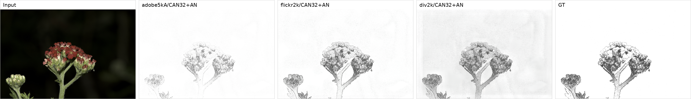
Adobe5kA test image. Left to right: input, the Adobe5kA / Flickr2K / Div2K ⁠ CAN32+AN ⁠ models, and the GT pencil sketch. The Adobe-trained model tracks the target most closely; the 2K-trained models render the same input with a slightly different tone.

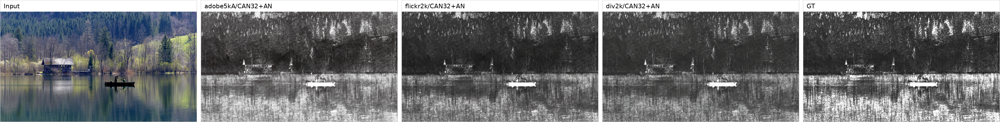
Flickr2K test image. Here the Flickr2K- and Div2K-trained models stay close to GT, while the Adobe-trained model is visibly washed out — the asymmetric transfer described below.

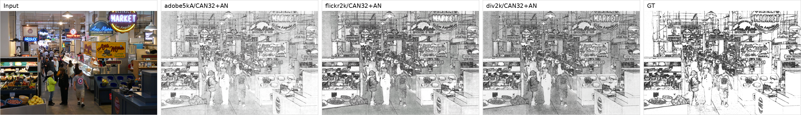
Div2K test image. Same pattern: the model trained on clean 2K data generalizes, the Adobe-trained model degrades on the clean input.


**TODO: explanation** (in progress)
Every cross-dataset pairing does worse than its same-dataset version, which tells us the learned pencil-sketch mapping is not purely a function of the operator (identical everywhere), but also depends on the image statistics of the training data.

The drop is very asymmetric. Models trained on Flickr2K and Div2K transferreasonably to Adobe5kA:
Flickr2K to Adobe reaches 18.70 dB, only about 1.4 dB below Adobe's own model (20.06 dB), and Div2K to Adobe reaches 16.46 dB. 
The Adobe-trained model transfers much worse the other way, falling to around 13.8 to 14.0 dB on both 2K datasets, roughly 5 to 6 dB below what those datasets get with their own models.

We assume this comes down to the input domain. 
The Adobe5kA inputs are the JPEG-compressed expert-A export and carry compression artifacts, while Flickr2K
and Div2K are native high-quality 2K images. 
A model trained on the cleaner, more
varied 2K data learns a more transferable approximation, whereas the Adobe-trained model overfits to its compressed inputs and struggles on clean ones. 
So the approximation depends strongly on the training set, and clean, more diverse training data generalizes better.

### 4.3 Cross-Resolution Generalization

The paper trains on randomly sampled image resolutions and evaluates the main results at 1080p. Since our training setup also uses random-resolution sampling, we evaluate whether the model behaves consistently across different evaluation resolutions.

For this experiment, we evaluate the same final checkpoint at multiple short-edge resolutions.

| Resolution | Model | MSE | PSNR (dB) | SSIM | Time (ms) |
|---:|---|---:|---:|---:|---:|
| 240p | ⁠ CAN32+AN ⁠ | 0.036506 | 14.376 | 0.576 | 1.7 |
| 480p | ⁠ CAN32+AN ⁠ | 0.016437 | 17.842 | 0.671 | 5.0 |
| 720p | ⁠ CAN32+AN ⁠ | 0.009771 | 20.101 | 0.714 | 15.3 |
| 1080p | ⁠ CAN32+AN ⁠ | 0.009625 | 20.166 | 0.733 | 35.6 |
| 1440p | ⁠ CAN32+AN ⁠ | 0.016645 | 17.787 | 0.725 | 63.4 |

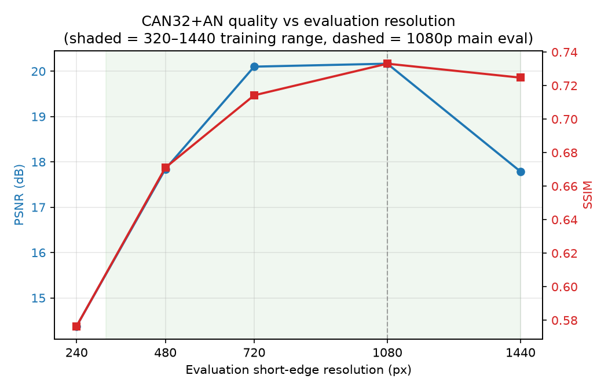
*PSNR and SSIM for the Adobe5kA ⁠ CAN32+AN ⁠ model evaluated at different short-edge
resolutions (shaded = 320–1440 training range, dashed = 1080p main eval). Quality
is highest inside the training range, peaking at 720–1080p (~20.1–20.2 dB). It
collapses at 240p (14.4 dB) — below the 320p training minimum — and drops again at
1440p (17.8 dB), while inference time grows with pixel count. The model transfers
well within the resolutions it was trained on but degrades outside them.*

**TO DO: add explanation still**

This experiment checks whether the model is sensitive to evaluation scale. We expect inference time to increase with resolution, while quality metrics may change depending on how well the learned operator transfers across image scales.

### 4.4 Training Progression Over Checkpoints

Since we save intermediate checkpoints during training, we also evaluate how the model improves over time. This gives a more detailed view of convergence and whether the full 500k training iterations are necessary in our setting.

We evaluate selected checkpoints at:

- 10k iterations
- 20k iterations
- 50k iterations
- 100k iterations
- 250k iterations
- 500k iterations

| Dataset | Model | Best Iteration | Best PSNR (dB) | Final PSNR (dB) | Best SSIM | Final SSIM |
|---|---|---:|---:|---:|---:|---:|
| Adobe5kA | `CAN24+AN` | 250k | 19.936 | 18.674 | 0.726 | 0.713 |
| Adobe5kA | `CAN24+AND` | 250k | 20.683 | 18.381 | 0.735 | 0.726 |
| Adobe5kA | `CAN32+AN` | 500k | 20.062 | 20.062 | 0.735 | 0.735 |
| Adobe5kA | `CAN32+AND` | 250k | 18.226 | 17.165 | 0.729 | 0.719 |
| Div2K | `CAN32+AN` | 250k | 20.269 | 19.399 | 0.738 | 0.734 |
| Flickr2K | `CAN32+AN` | 500k | 20.049 | 20.049 | 0.743 | 0.743 |

**Talk about the table**

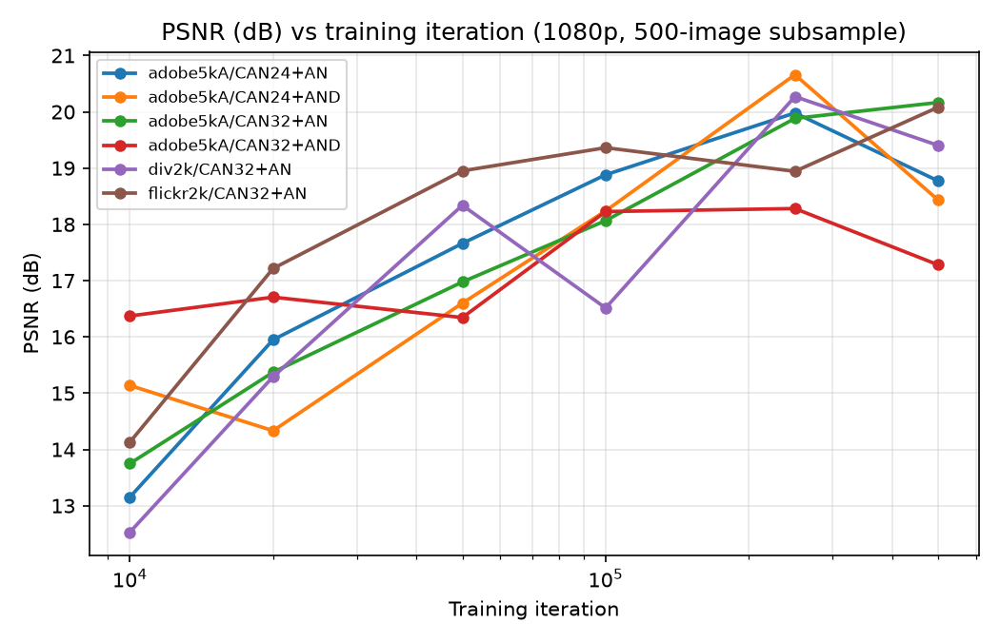
*Held-out PSNR vs training iteration (log scale), one line per model. All models
improve steeply up to ~100k. Four of six (`CAN24+AN`, `CAN24+AND`, `CAN32+AND`,
Div2K) peak at 250k and then regress slightly by 500k, whereas only the plain
`CAN32+AN` models (Adobe5kA and Flickr2K) keep improving to 500k.*

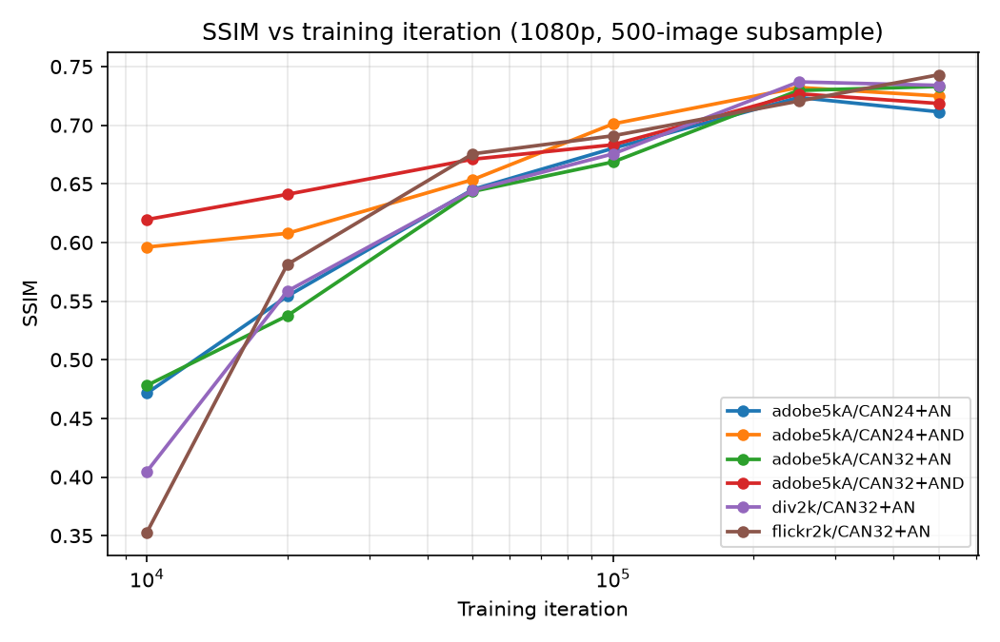
*The same models scored by SSIM. The trajectories are smoother than PSNR and
largely plateau by 250k, with little of the late-training regression seen in PSNR —
i.e. structural similarity is more stable than pixel-level error in the final
quarter of training.*

**TODO: [DEMO] show the learned filter using demo.py for the different models? perhaps include one or two in the main body, the rest in the appendix** (in progress)

The figure below shows the learned filter for all four Adobe5kA variants on the same held-out image. The two paper variants (⁠ CAN24+AN ⁠, ⁠ CAN32+AN ⁠) and the two adaptive-dilation variants (⁠ CAN24+AND ⁠, ⁠ CAN32+AND ⁠) all recover the broad pencil-sketch structure; differences are in how much fine line detail and contrast each reproduces relative to the GT. Additional per-variant samples are in [Appendix C](#c-additional-demo-images).

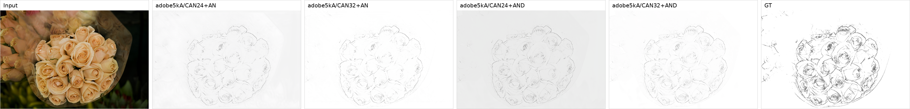
Adobe5kA test image through ⁠ CAN24+AN ⁠, ⁠ CAN32+AN ⁠, ⁠ CAN24+AND ⁠, ⁠ CAN32+AND ⁠, with input and GT for reference.


**TODO: EXPLANATION. Answer the question, did we really need to train 500k iterations?**

### 4.5 Training Log Analysis

Additionally, we analyze the training logs saved during optimization. These logs are used as supporting evidence in our study. The main claims are based on held-out test metrics, not training loss.

The plot shows training loss over iterations. This helps verify that the model is learning during training and that optimization is stable.

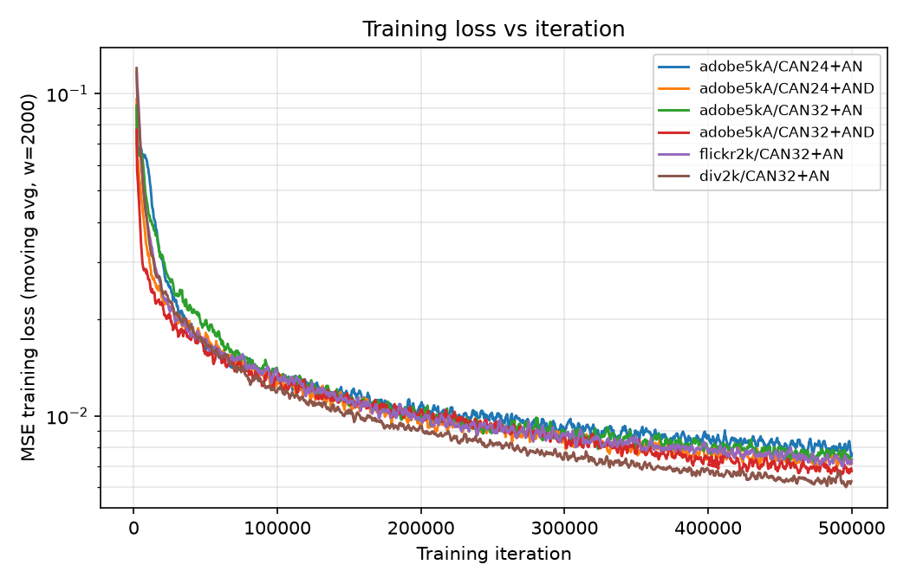
*MSE training loss vs iteration (moving average, window = 2000; log y-axis), one
line per model. All runs drop steeply over the first ~20–50k iterations and then
decline slowly and stably for the remainder, confirming that optimization is
stable under the batch-size-1, random-resolution regime. Notably, training loss
keeps decreasing all the way to 500k even though held-out PSNR (§4.4) peaks around
250k for most models — so the late-training gains largely reflect fitting the
training set rather than improved generalization.*

**TODO: EXPLANATION**

### 4.6 Qualitative Results

We also generate qualitative demos using held-out test images. Each demo shows the input image, predictions from selected models, and the ground truth pencil-sketch target.

**TODO: INSERT DEMO IMAGES HERE FOR ALL MODEL VARIANTS** (in progress)

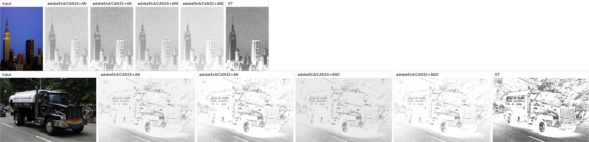
Adobe5kA held-out images through all four variants (⁠ CAN24+AN ⁠, ⁠ CAN32+AN ⁠, ⁠ CAN24+AND ⁠, ⁠ CAN32+AND ⁠) with input and GT.

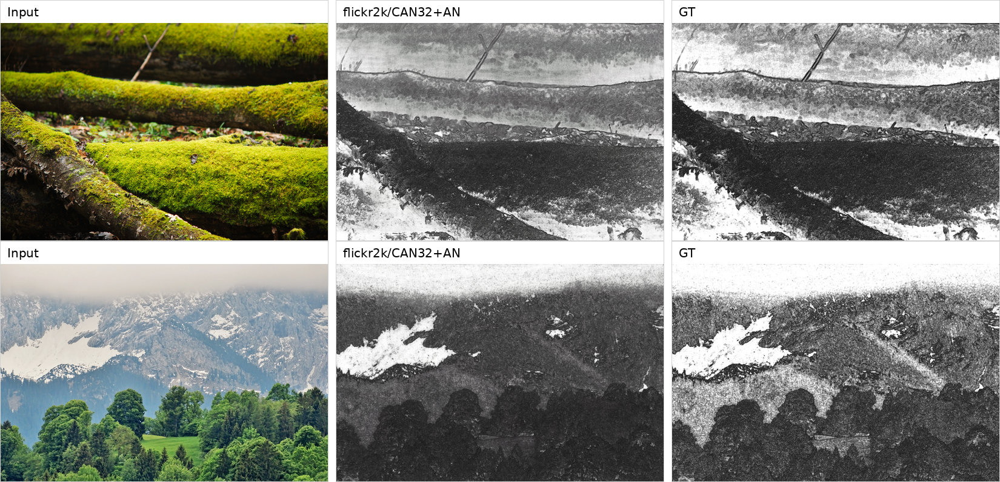
Flickr2K held-out images through the Flickr2K-trained ⁠ CAN32+AN ⁠ model.

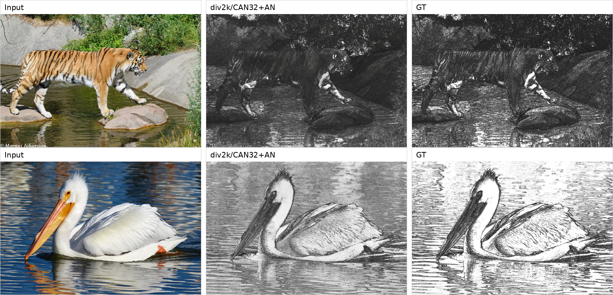
Div2K held-out images through the Div2K-trained ⁠ CAN32+AN ⁠ model.


## 5. Discussion (WIP)

### 5.1 Did We Uphold the Paper's Main Claim?

### 5.2 Main Findings

### 5.3 Limitations

Although Section 2 defines the reproduction scope, several limitations affect how directly our results can be compared to the original paper.

- **Exact implementation details.** The main CAN variant code was not released by the original authors. More specifically, only the single-network and parameterized-network code was available. Our implementation is therefore based on the paper description and reimplemented in PyTorch. Therefore, small differences in initialization, padding behavior, optimizer details, preprocessing, and framework-specific layer behavior may affect exact numerical reproducibility.

- **Single operator.** The original paper evaluates ten image-processing operators, while we only reproduce the pencil-sketch operator. This means our results test the CAN architecture in one setting, but not across the full range of operators studied in the paper. Additionally, we use OpenCV's `cv2.pencilSketch()` rather than the exact pencil-sketch implementation used by the original authors.

- **Different cross-dataset setup.** The paper uses MIT-Adobe and RAISE for cross-dataset generalization. We use Adobe5kA, Flickr2K, and Div2K instead.

- **No baseline methods.** We do not reproduce the non-CAN baselines from the paper, such as FCN-8s and the encoder-decoder models. Our comparisons are therefore mainly between our own CAN variants.

- **Unequal dataset sizes.** Adobe5kA, Flickr2K, and Div2K have different numbers of training images. This means cross-dataset performance may reflect both dataset distribution and dataset size.

- **Runtime comparison.** Runtime depends on hardware, so our `Time (ms)` values are only directly comparable within our own experiments.


## 6. Conclusion

## Appendix

### A. Reproducibility Details

### B. Additional Results

### C. Additional Demo Images

### D. Team Contributions

| Team Member | Reproducibility Criteria | Contributions |
|---|---|---|
| Robin Kruijf | New algorithm variant | Implemented the adaptive-dilation CAN variants using deformable convolutions. Contributed to the `CAN24+AND` and `CAN32+AND` model variants used in the architecture ablation. |
| Ocean Wang | Reproduced | Adapted the author's released TensorFlow parameterized-network implementation and used it to attempt reproducing the main CAN contribution. The original CAN variant code was not explicitly released, so this was based on the closest available official code. |
| Johnny Wu | Replicated, New code variant | Reimplemented the core CAN training and evaluation pipeline in PyTorch, including dataset loading, random-resolution training, fixed train/test splits, demo generation, and evaluation.|
| Nicholas Wu | New data, Ablation study | Added support for Div2K and Flickr2K experiments, model-training, preprocessing/run scripts. **TBD: Experiments on cross-dataset, cross-resolution and checkpoint-progression experiments.**|